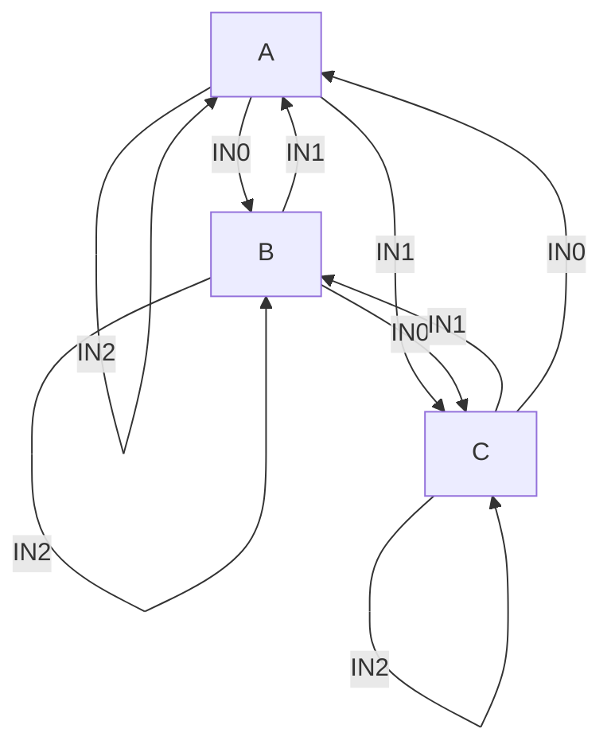

# Calculator Hardware
> Calculator design using  VHDL

 ## Table of contents
* [Labs](#labs)
   * [1](#adder-design)
   * [2](#bit-cla-and-fsm)
   * [3](#post-increment-pre-decrement-stack)
   * [4](#operations-for-calculator-design)
   * [5](#full-calculator) 
* [How to run](#how-to-run)
* [Acknowledgments](#acknowledgments)

## Adder design
### Circuit
<br>

| Name |  In/Out  |  Width  | Board |
| ------- | --- | --- | --- |
| IN0 | IN | 1 | SW0 |
| IN1 | IN | 1 | SW1 |
| BTN0 | IN | 1 | BTN0 |
| BTN1 | IN | 1 | BTN1 |
| BTN2 | IN | 1 | BTN2 |
| BTN3 | IN | 1 | BTN3|
| LED | OUT | 8 | LD0 - LD7 |

<br><br>

* LED[0] <= IN0 AND IN1 AND BTN0
* LED[1] <= IN0 XOR IN1 AND BTN1
* LED[2] <= IN0 NOR IN1 AND BTN2
* LED[3] <= NOT IN0 AND BTN3
* LED[4] <= IN0
* LED[5] <= IN1

### FA
[FA](https://github.com/z1skgr/Advanced-Design/issues/1#issue-1164228981)
<br>

#### HA
<br>


| Name |  In/Out  |  Width  | Board |
| ------- | --- | --- | --- |
| IN0 | IN | 1 | SW0 |
| IN1 | IN | 1 | SW1 |
| IN2 | IN | 1 | SW2 |
| LED | OUT | 2 | LD0 - LD1 |

<br>

[HA](https://github.com/z1skgr/Advanced-Design/issues/2#issue-1164229190)

<br>

Check ```.ucf``` file to link with FPGA 


<br><br>

## Bit CLA and FSM
### 4-bit Carry Look Ahead

<br>

| Name |  In/Out  |  Width  | Board |
| ------- | --- | --- | --- |
| A | IN | 1 | SW0 |
| B | IN | 1 | SW1 |
| C<sub>in</sub> | IN | 1 | SW2 |
| S | OUT | 4 | LD3 - LD0 |
| C<sub>3</sub>  | OUT | 1 | LD5 |


<br>

### FSM
| Name |  In/Out  |  Width  | Board |
| ------- | --- | --- | --- |
| RST | IN | 1 | PB0 |
| CLK | IN | 1 | MCLK |
| IN0 | IN | 1 | PB1 |
| IN1 | IN | 1 | PB2 |
| IN2 | IN | 1 | PB3 |
| LED  | OUT | 8 | LD0-LD7 |


<br><br>




<br>

## Post increment Pre decrement Stack

* 32 ELEMENT 8 BIT STACK


| Name |  In/Out  |  Width  | Board |
| ------- | --- | --- | --- |
| PUSH | IN | 1 | BTN0 |
| POP | IN | 1 | BTN1 |
| NOT USED | IN | 1 | BTN2 |
| RESET| IN | 1 | MCLK |
| CLOCK | IN | 1 | PB3 |
| NUM IN | IN | 8 | SW7-SW0 |
| NUM OUT | OUT | 8 | LED7-LED0 |
| SSD EN | OUT | 4 | AN3-AN0 |
| EMPTY  | OUT | 1->7 | SEG6-SEG0 (E) |
| FULL | OUT | 1->7 | SEG6-SEG0 (F) |
| STACK OVF | OUT | 1->7 | SEG6-SEG0 (OVF) |


__ACTIONS__ 
* PUSH NUMBER
* POP NUMBER
* STACK OVERFLOW
* STACK RESET
* SEVEN SEGMENT DISPLAY
   * OVF
   * E
   * F


<br>

## Operations for calculator design


<br>

1. PUSH
2. POP
3. ADD 2'S COMPLIMENT NUMBER
4. SUBTRACK 2'S COMPLIMENT NUMBER
5. UNARY SUBTRACTION
6. X<>Y


<br>

| Name |  In/Out  |  Width  | Board |
| ------- | --- | --- | --- |
| PUSH | IN | 1 | BTN0 |
| POP | IN | 1 | BTN1 |
| MODE | IN | 1 | BTN2 |
| RESET| IN | 1 | MCLK |
| CLOCK | IN | 1 | PB3 |
| NUM IN | IN | 8 | SW7-SW0 |
| NUM OUT | OUT | 8 | LED7-LED0 |
| SSD EN | OUT | 4 | AN3-AN0 |
| EMPTY  | OUT | 1->7 | SEG6-SEG0 (E) |
| FULL | OUT | 1->7 | SEG6-SEG0 (F) |
| STACK OVF | OUT | 1->7 | SEG6-SEG0 (OVF) |


<br>

| ACTION |  FIRST TOUCH |  SECOND TOUCH  | THIRD TOUCH |
| ------- | --- | --- | --- |
| ------- |  Mode 0 |  Mode 1  | Mode 2 |
| PUSH | BTN0 |  |  |
| POP | BTN1 |  |  |
| ADD | BTN2 | BTN0 |  |
| SUB| BTN2| BTN1 |  |
| UNARY | BTN2 | BTN2 | BTN0 |
| X<>Y | BTN2 | BTN2| BTN1 |
| TO MODE0 | BTN2 | BTN2 | BTN2 |
| RESET| BTN3| | |


<br><br>

## Full Calculator

<br>

1. PUSH
2. POP
3. ADD 2'S COMPLIMENT NUMBER
4. SUBTRACK 2'S COMPLIMENT NUMBER
5. UNARY SUBTRACTION
6. X<>Y

<br>
1. ADDSUBTRACTOR
  * CLA 8-BIT
  * XOR USING A CONTROL SIGNAL
  
2. OVERFLOW STATE
   * XNOR ON ADD
   * XOR ON SUB
3. TEMP REGISTERS 
   * SAVE 2 LAST POPS
4. FSM
   * PUSH/POP/RESET
   * ADD/SUB
      * POP HEAD , HEAD-1
      * PUSH HEAD
   * UNARY SUB
      * COPY HEAD,
      * POP HEAD-1
      * PUSH HEAD-1 


<br>


## How to Run
### For Simulation
1. Import project to workspace suite
2. Behavioral Check Syntax/Simulate Behavioral Model to .vdl
3. Simulate Behavioral Model on Test Bench

### For Synthesis (.vhd)
1. Find Synthesize from ```Processes``` tab
2. Follow Implement Design steps
3. Download load file
4. UCF file for board link
5. Configure Target Device

### For Core Generation (.xco)
1. New Source->IP(CORE Generator)
2. Memories & Storage Elements -> RAMs & ROMs -> Block Memory Generator
3. Single Port RAM Memory Type
4. Implementation View-> View HDL Functional Model for source code


## Acknowledgments
* Projects were created for the requirements of the lesson Advanced Logic Design
* First attempts on Xilinx Suite learning VHDL

[^1]: Stack is build from Xilinx Core Generator. Depth 32 positions, Width 8 bits
[^2]: SinglePulseGenerator.vhd is used for simulation on FPGA. Pulse in FPGA's buttons.
[^3]: Test Benches for interior designs for testing.
[^4]: Full Design in block diagram stack.vsdx. 
[^5]: Internal implementations in the other diagrams inside every lab.


